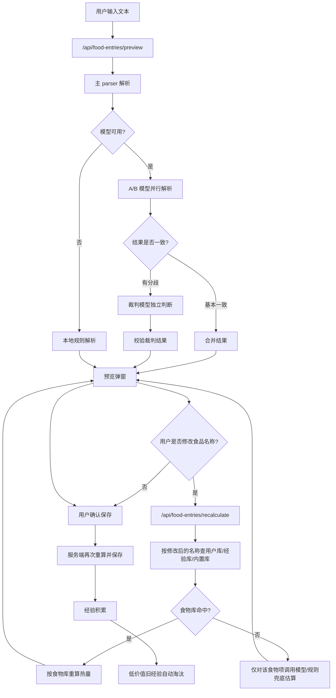

# Diet Tracker

本地运行的饮食、饮水和体重记录应用。前端使用 React + TypeScript + Vite + Tailwind CSS，后端使用 Node.js 原生 HTTP 服务，数据保存在本地 SQLite 文件中。

当前版本的核心定位很明确：用户只负责输入饮食内容，必要时只修改“食品名称”；热量由系统通过食物库、经验库和模型兜底自动计算。

## 架构概览

- 前端入口仍是 `client/src/App.tsx`，页面数据、饮食提交、饮水操作和重置逻辑已经拆到 `client/src/hooks/`。
- 后端保留 `server/app.js`、`server/repository.js`、`server/llmClient.js` 等旧入口文件，作为薄的 barrel re-export；内部实现按职责拆到 `server/app/`、`server/repository/`、`server/llm/`。
- 解析层保留 `server/parser/orchestrator.js` 和 `server/parser/foodLibrary.js` 作为稳定入口；多模型编排、裁判校验、食物库查找和运行时别名已经拆成子模块。
- 当前模型没有写死供应商，只要兼容 OpenAI `/chat/completions` 接口，就可以通过 `.env` 配置为 `LLM_A`、`LLM_B` 或 `LLM_C`。

## 当前状态

- 本地访问地址：`http://127.0.0.1:3000`
- 后端入口：`server/index.js`
- 前端入口：`client/src/App.tsx`
- 前端构建产物：`public/`
- SQLite 数据库：`data/diet.sqlite`
- 当前输入方式：文本输入
- 图片识别：代码中尚未实现前端上传和图片解析接口

## 暂未实现

- 图片上传入口
- 图片转食品候选的视觉模型接口
- 测试集自动验证闭环
- 错误案例摘要自动加载到下一次解析 prompt

## 快速启动

### Windows 推荐方式

双击项目根目录下的 `start-diet-tracker.bat`。

该脚本会调用 `scripts/start-diet-tracker-clean-env.ps1`，用于规避某些 PowerShell/Codex 环境里 `Path` 和 `PATH` 同时存在导致 `Start-Process` 报错的问题。

### 后台启动

```powershell
powershell.exe -NoProfile -ExecutionPolicy Bypass -File scripts\start-diet-tracker-clean-env.ps1 -Background
```

启动成功后访问：

```text
http://127.0.0.1:3000
```

### 直接启动后端

```powershell
npm.cmd start
```

等价于：

```powershell
node server/index.js
```

服务默认监听 `.env` 中的 `PORT`，未配置时使用 `3000`。

## 开发命令

Windows PowerShell 中如果 `npm` 被解析为 `npm.ps1` 并触发执行策略问题，优先使用 `npm.cmd`。

```powershell
npm.cmd run dev      # 启动 Vite 开发服务，默认 http://127.0.0.1:5173
npm.cmd start        # 启动 Node 后端服务
npm.cmd run build    # 构建前端到 public/
npm.cmd test         # 运行 Node 测试
```

Vite 开发服务会把 `/api` 代理到 `http://127.0.0.1:3000`。

## 主要功能

- 自然语言记录饮食和饮水，例如“一个包子，两个鸡蛋，一瓶水”。
- 解析结果先进入确认弹窗，不会直接保存。
- 用户在弹窗中只能修改食品名称，不能手填热量。
- 食品名称修改后，后端会重新计算热量并刷新弹窗。
- 热量计算优先级：用户食物库/经验别名 -> 内置食物库 -> 模型或规则兜底。
- 食物库匹配不到时，只对未匹配的单个食物项调用 parser 兜底估算，不重新改写整条记录。
- 用户确认保存后，系统会沉淀识别经验；低价值旧经验会自动淘汰。
- 饮水按 ml 单独记录，不计入热量。
- 支持快捷饮水、自定义饮水量。
- 支持记录体重，并基于固定身高计算 BMI、热量目标和饮水目标。
- 支持按日期查看饮食、饮水、体重摘要和趋势。
- 趋势区块支持「饮食 / 体重」双视图切换，以及「当日 / 7天 / 30天 / 自定义」时间范围切换。
- 饮食趋势展示热量与饮水的多日曲线；体重视图展示体重变化曲线，缺失日期自动用前一天体重填充，无前值时取区间平均值，仍无则补 0 以保持曲线连贯。
- 自定义日期范围选择器预填最近 7 天，避免空白输入。
- 支持删除整条饮食记录、单条饮水记录。
- 解析过程会记录模型日志和裁判统计，便于后续分析模型表现。

## 最新识别流程



## 解析和保底策略

### 1. 无模型配置

如果 `.env` 没有配置 LLM，应用仍可运行。此时 parser 使用本地规则解析常见食物、数量、单位和饮水。

### 2. 单模型或双模型

配置 `LLM_A` 或 `LLM_B` 后，后端会尝试模型解析。两个模型都配置时，会并行调用并比较结果。

模型本身不写死。每组模型由 `LLM_X_API_KEY`、`LLM_X_BASE_URL`、`LLM_X_MODEL` 三个环境变量决定；任意一个缺失，该模型就视为未配置。

代码里对 Kimi、DeepSeek、Claude 等名称有少量参数适配，例如 thinking、reasoning effort、显示名称等，但这些只是兼容处理，不代表必须使用这些模型。

### 3. 裁判模型

配置 `LLM_C` 后，当 A/B 结果分歧明显时，会调用裁判模型做独立判断。裁判结果仍会经过校验，不会无条件采用。

### 4. 食物库优先

用户改名后的重算不会相信前端热量，也不会直接沿用模型热量。后端会用修改后的食品名称查：

1. 用户保存的食物库 `foods`
2. 自动学习的别名 `food_aliases`
3. 内置食物库 `server/parser/foodLibrary.js`

### 5. 模型兜底

如果食物库查不到，系统会构造单项食物文本，例如“1个某食物”，只让 parser 估算这一项热量。

兜底成功时：

- 该食物项来源标记为 `llm_fallback`
- 弹窗标记需要确认
- 用户确认保存后才会进入经验沉淀

兜底失败时：

- 保留原估算
- 来源标记为 `llm_fallback_failed`
- 弹窗继续提示需要确认

## 经验机制

系统有两类经验来源：

- `foods`：用户食物库，优先级最高，适合保存明确可信的个人食品。
- `food_aliases`：系统从保存记录中自动学习的别名和单位热量。

经验加载逻辑：

- 服务启动时加载 `foods` 和 `food_aliases` 到运行时食物库。
- 用户保存记录后，会从食物项中自动学习别名。
- 用户食物库优先级高于自动别名和内置库。

淘汰逻辑：

- `food_aliases` 中 `use_count <= 1` 且超过 60 天未使用的自动经验会被删除。
- `source LIKE 'user_%'` 的用户经验不会被自动淘汰。
- 清空别名接口会清空 `food_aliases`，随后重新加载 `foods` 用户食物库；用户食物库本身不会被这个接口删除。

## 项目结构

```text
jfwork/
├─ client/                          # 前端：React 19 + TypeScript + Vite + Tailwind v4
│  ├─ src/
│  │  ├─ App.tsx                    # 组合 hooks、状态和主页面渲染
│  │  ├─ api.ts                     # fetch 封装
│  │  ├─ types.ts                   # TypeScript 类型
│  │  ├─ constants.ts               # 目标热量、身高、饮水系数等常量
│  │  ├─ utils.ts                   # 工具函数 barrel（re-export 自 utils/）
│  │  ├─ utils/                     # date / metrics / tone / chart
│  │  ├─ hooks/                     # useDailyData / useFoodEntry / useWaterActions /
│  │  │                             # useMutations / useResetData
│  │  └─ components/                # Header / Dashboard / WaterSection / TrendSection /
│  │                                # EntryList / ResultModal / LoadingOverlay / ...
│  └─ vite.config.ts
├─ server/                          # 后端：原生 Node.js HTTP + node:sqlite
│  ├─ index.js                      # 启动入口
│  ├─ app.js                        # createApp barrel
│  ├─ app/                          # httpUtils / static / normalize / routes/
│  │                                # routes 按业务域拆：food-entries / food-items /
│  │                                # food-aliases / water / weight / summaries / misc
│  ├─ repository.js                 # createRepository barrel
│  ├─ repository/                   # time / mappers / aliasNormalize / statements /
│  │                                # aliases / foodEntries / foodItems / waterEntries /
│  │                                # weightEntries / summaries / parseLogs / clearAll
│  ├─ llmClient.js                  # createConfiguredParser barrel
│  ├─ llm/                          # rateLimiter / circuitBreaker / prompts /
│  │                                # modelConfig / httpClient / decisionLogger / parser
│  ├─ db.js                         # SQLite 初始化和迁移
│  ├─ config.js                     # .env 读取
│  ├─ logger.js                     # 结构化日志和可读日志
│  ├─ cache.js                      # 解析缓存
│  └─ parser/
│     ├─ orchestrator.js            # parseWithModels barrel
│     ├─ orchestrator/              # fuzzyMatch / quantityCompare / modelNormalize /
│     │                             # diffAnalysis / judgeValidation / index
│     ├─ ruleParser.js              # 本地规则解析
│     ├─ schema.js                  # LLM JSON 结构校验
│     ├─ foodLibrary.js             # 食物库 barrel
│     └─ foodLibrary/               # builtinFoods / nameAliases / runtimeAliases /
│                                   # lookup / calorieRange / applyLibrary
├─ data/                            # SQLite 数据库
├─ docs/                            # 研究报告、计划和设计文档
├─ public/                          # 前端构建产物
├─ scripts/                         # 启动脚本
├─ test/                            # Node 测试
├─ package.json
└─ README.md
```

> `server/app.js`、`server/repository.js`、`server/llmClient.js`、`server/parser/orchestrator.js`、
> `server/parser/foodLibrary.js` 都是稳定入口。内部拆分不会影响外部 import 路径，测试仍可继续
> `import ... from '../server/...'`。

## 环境变量

在项目根目录创建或编辑 `.env`：

```env
PORT=3000

LLM_A_API_KEY=sk-...
LLM_A_BASE_URL=https://api.example.com/v1
LLM_A_MODEL=model-a

LLM_B_API_KEY=sk-...
LLM_B_BASE_URL=https://api.example.com/v1
LLM_B_MODEL=model-b

LLM_C_API_KEY=sk-...
LLM_C_BASE_URL=https://api.example.com/v1
LLM_C_MODEL=model-c

LLM_TIMEOUT_MS=30000
LLM_RATE_LIMIT_PER_SEC=10
LLM_MAX_RETRIES=2
LLM_CIRCUIT_FAILURE_THRESHOLD=5
LLM_CIRCUIT_RECOVERY_MS=60000

PARSE_CACHE_SIZE=1000
PARSE_CACHE_TTL=3600000

LLM_JUDGE_THINKING=enabled
LLM_FAST_PATH=false
L2_ENABLED=false
L4_ENABLED=false
```

说明：

- 未配置 LLM 时，应用会使用本地规则解析。
- 只配置 `LLM_A` 或 `LLM_B` 时，可以单模型解析。
- 同时配置 `LLM_A` 和 `LLM_B` 时，会进行双模型比较。
- 配置 `LLM_C` 后，A/B 分歧时可启用裁判模型。
- `BASE_URL` 需要是兼容 OpenAI Chat Completions 的服务地址，代码会请求 `${BASE_URL}/chat/completions`。
- `LLM_FAST_PATH=true` 会让短输入走单模型快速通道；默认关闭。
- 不要把真实 API Key 提交到版本库。

## 常用接口

```text
POST   /api/food-entries/preview       # 解析预览，不保存
POST   /api/food-entries/recalculate   # 用户改食品名称后重新计算热量
POST   /api/food-entries               # 确认并保存饮食记录
GET    /api/food-entries?date=YYYY-MM-DD
PUT    /api/food-entries/confirm       # 按日期批量确认
PUT    /api/food-entries/:id/confirm   # 单条确认
DELETE /api/food-entries/:id

PUT    /api/food-items/:id             # 遗留维护接口：单项热量修正
DELETE /api/food-items/:id

POST   /api/water-entries
GET    /api/water-entries?date=YYYY-MM-DD
DELETE /api/water-entries/:id

POST   /api/weight-entries
GET    /api/weight-entries?start=YYYY-MM-DD&end=YYYY-MM-DD

GET    /api/daily-summary?date=YYYY-MM-DD
GET    /api/daily-summaries?start=YYYY-MM-DD&end=YYYY-MM-DD

GET    /api/food-aliases               # 获取学习到的食物别名
DELETE /api/food-aliases               # 清空 food_aliases 并重新加载用户食物库
DELETE /api/all-data                   # 清空所有本地数据
```

### 预览饮食记录

```json
{
  "text": "一个包子，两个鸡蛋，一瓶水",
  "recordedAt": "2026-06-07T08:30:00+08:00"
}
```

### 改名后重算

```json
{
  "parsed": {
    "rawText": "一个茶叶蛋",
    "foodItems": [
      {
        "name": "鸡蛋",
        "quantity": 1,
        "unit": "个",
        "calories": 120
      }
    ],
    "waterItems": []
  }
}
```

注意：`calories` 会被服务端重新计算，前端传来的数值不会被信任。

### 保存饮水

```json
{
  "amountMl": 300,
  "recordedAt": "2026-06-07T08:30:00+08:00"
}
```

### 保存体重

```json
{
  "date": "2026-06-07",
  "weightKg": 60,
  "recordedAt": "2026-06-07T08:30:00+08:00"
}
```

## 数据存储

应用数据保存在 `data/diet.sqlite`。删除该文件会清空本地饮食、饮水、体重、经验库和日志表数据；重新启动服务时会自动创建数据库结构。

| 表名 | 用途 |
| --- | --- |
| `food_entries` | 饮食记录主表 |
| `food_items` | 食物明细 |
| `water_entries` | 饮水记录 |
| `weight_entries` | 体重记录 |
| `foods` | 用户食物库 |
| `food_aliases` | 自动学习的食物别名 |
| `settings` | 应用设置 |
| `parse_logs` | 解析过程日志 |
| `judge_stats` | 裁判决策统计 |

## 日志

- `server.log`：后台启动时的标准输出。
- `server.err.log`：后台启动时的错误输出。
- `logs/llm-readable-YYYY-MM-DD.log`：可读的 LLM 过程日志。
- `logs/llm-YYYY-MM-DD.log`：结构化 LLM JSON 日志。

日志默认保留 7 天，并自动轮转。

## 清理和恢复

可安全删除的本地生成内容：

| 路径 | 用途 | 删除影响 | 恢复方式 |
| --- | --- | --- | --- |
| `node_modules/` | npm 依赖 | 项目暂时无法运行 | `npm install` |
| `public/assets/` | 前端构建产物 | 静态页面资源缺失 | `npm.cmd run build` |
| `server.log` / `server.err.log` | 启动日志 | 只丢失历史日志 | 下次启动自动生成 |
| `logs/` | 运行日志 | 只丢失历史日志 | 下次运行自动生成 |

谨慎删除：

| 路径 | 用途 | 删除影响 |
| --- | --- | --- |
| `data/diet.sqlite` | 本地数据库 | 会丢失饮食、饮水、体重、用户食物库和经验别名 |
| `.env` | 本地配置和 API Key | LLM 配置丢失，端口恢复默认 |

## 验证

确认服务可用：

```powershell
Invoke-WebRequest -UseBasicParsing http://127.0.0.1:3000/api/daily-summary
```

运行测试：

```powershell
npm.cmd test
```

构建前端：

```powershell
npm.cmd run build
```
